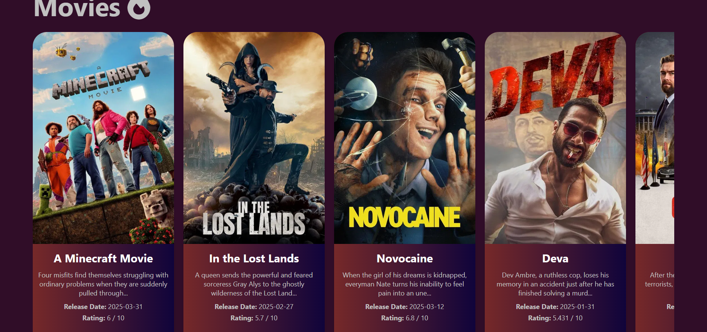
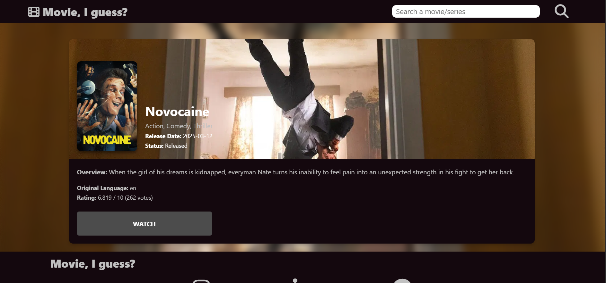
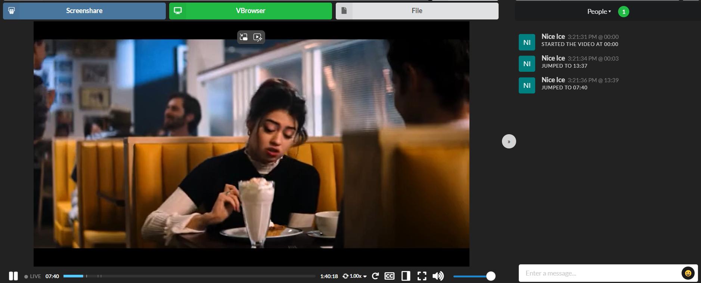

# 🎬 movieIguess

Welcome to **movieIguess**, your one-stop streaming frontend for movies and TV shows!  
Discover, watch, and host watch parties with friends – all in one sleek interface.

Link: https://xtian69420.github.io/movieIguess/

---

## 🚀 Features

- 🔍 **Search & Discover**: Instantly find movies and shows using TMDB integration.
- 📺 **Watch Streaming Content**: Stream content via embedded players (proxy to strip ads).
- 👯 **Watch Party Mode**: Sync playback with friends and chat in real-time.
- 🎨 **Responsive UI**: Optimized for desktop and mobile devices.

---
## Plans in the future
- Upgrade UI
- Search Suggestions
- Accounts
---

## 🖼️ Screenshots

### Homepage  


### Movie Details Page  


### Watch Party Mode  


---

## ⚙️ Tech Stack

**Frontend**
- React + TailwindCSS
- TMDB API
- Vidsrc.icu embeds (via backend proxy)

**Backend**
- Node.js + Express
- MongoDB (Database name: `movieIguess`)
- Proxy service to clean 3rd-party embeds

---

## 🛠️ Setup & Installation

### 1. Clone the repo

```bash
git clone https://github.com/yourusername/movieIguess.git
cd movieIguess
```
### 2. Install dependencies
```bash
# For backend
cd backend
npm install
```
# For frontend
cd ../frontend
npm install
### 3. Setup environment variables
Create a .env file in both frontend/ and backend/ with:

# TMDB API Key
```bash
TMDB_API_KEY=your_tmdb_key
```

# Backend
```bash
PORT=5000
MONGO_URI=mongodb://localhost:27017/movieIguess
PROXY_SECRET=your_secret
```

### 4. Run the project
```bash
# Start backend
cd backend
npm run dev

# Start frontend
cd ../frontend
npm start
```
