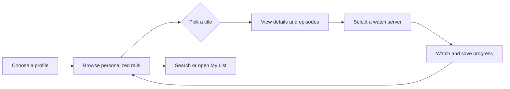

# MovieIGuess

> **Find the next thing worth watching.**
>
> A fast, Netflix-style movie and series discovery interface powered by TMDB.

<p align="center">
	<a href="https://xtian69420.github.io/movieIguess/">Open MovieIGuess</a>
	&nbsp;&middot;&nbsp;
	<a href="#-what-you-can-do">Explore features</a>
	&nbsp;&middot;&nbsp;
	<a href="#-project-status">Project status</a>
</p>

<p align="center">
	
	
	
	
</p>

<details>
<summary><strong>Quick jump</strong></summary>

- [What you can do](#-what-you-can-do)
- [How it works](#-how-it-works)
- [Built with](#-built-with)
- [Project map](#-project-map)
- [Project status](#-project-status)
- [Notes](#-notes)

</details>

## ✨ What you can do

| Discover | Make it yours | Watch |
| --- | --- | --- |
| Search movies, series, people, genres, and descriptions | Create up to five local profiles | Choose from multiple embedded watch servers |
| Browse curated rails for movies, shows, anime, K-dramas, crime, romance, and more | Save titles to **My List** and mark favorites | Resume titles from **Continue Watching** |
| Explore a rotating hero title, trailers, logos, ratings, and similar picks | Tune recommendations with profile preferences | Select TV seasons and episodes before playback |

### A calmer way to browse

- **Smart search** blends local catalog matches with TMDB results.
- **Profile-aware rows** adapt to selected titles, preferences, and viewing history.
- **Kids profiles** switch the catalog to family-friendly discovery rows.
- **Responsive rails** keep browsing comfortable on phones, tablets, and desktops.
- **Download links** show the detected file format, including formats such as `MP4` and `MKV` when provider metadata exposes the filename.

## 🧭 How it works


```mermaid
flowchart LR
		A[Choose a profile] --> B[Browse personalized rails]
		B --> C{Pick a title}
		C --> D[View details and episodes]
		D --> E[Select a watch server]
		E --> F[Watch and save progress]
		F --> B
		B --> G[Search or open My List]
```

<details>
<summary><strong>What is stored in the browser?</strong></summary>

MovieIGuess keeps profile data, the active profile, My List entries, selected server preference, and watch progress in `localStorage`. There is no account system in the current frontend.

</details>

## 🧱 Built with

| Layer | Technology |
| --- | --- |
| Interface | HTML, CSS, and modern browser JavaScript modules |
| Metadata | [TMDB API](https://www.themoviedb.org/documentation/api) |
| Playback | Configurable third-party embedded players |
| Downloads | Provider adapter with streamed progress updates |
| Hosting | Firebase Hosting |
| Persistence | Browser `localStorage` |

## 🗂️ Project map

```text
index.html                 App entry point
src/new-ui/netflix-ui.js   Main application, navigation, search, profiles, and playback
src/new-ui/netflix-ui.css  Streaming-style interface
src/new-ui/profile-store.js Profile persistence helpers
src/new-ui/prewatch-page.js Pre-watch flow and download modal
src/new-ui/download-provider.js Download provider adapters
src/assets/                Local UI assets
firebase.json              Hosting configuration
```

## 🚧 Project status

| Area | Status |
| --- | --- |
| Movie and series discovery | Available |
| Profiles and kids mode | Available |
| Search and personalized rows | Available |
| Embedded playback | Available, provider-dependent |
| Download selection | Available, provider-dependent |
| Games | Planned |
| Browse by languages | Planned |
| Cloud accounts and sync | Planned |

## 📝 Notes

- Movie metadata and artwork are provided by TMDB. MovieIGuess is not affiliated with TMDB.
- Playback and download availability depends on external providers and can change independently of this project.
- Use the project only with content and services you are authorized to access.

<p align="center">
	<strong><a href="https://xtian69420.github.io/movieIguess/">Start browsing</a></strong>
</p>
